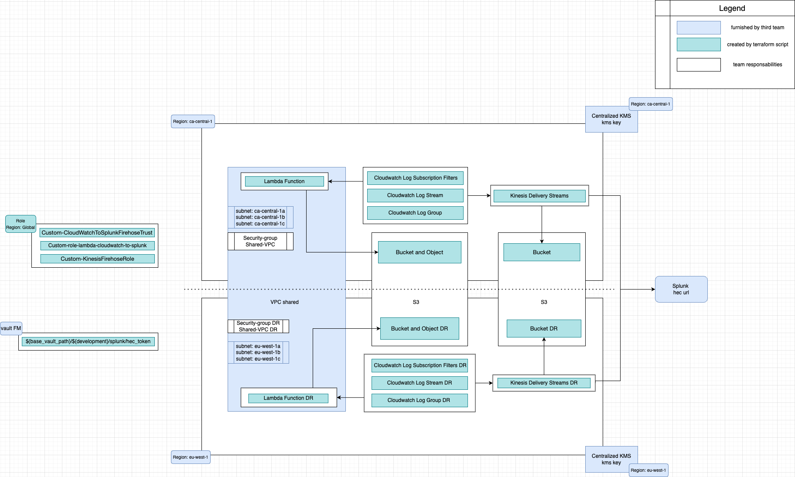
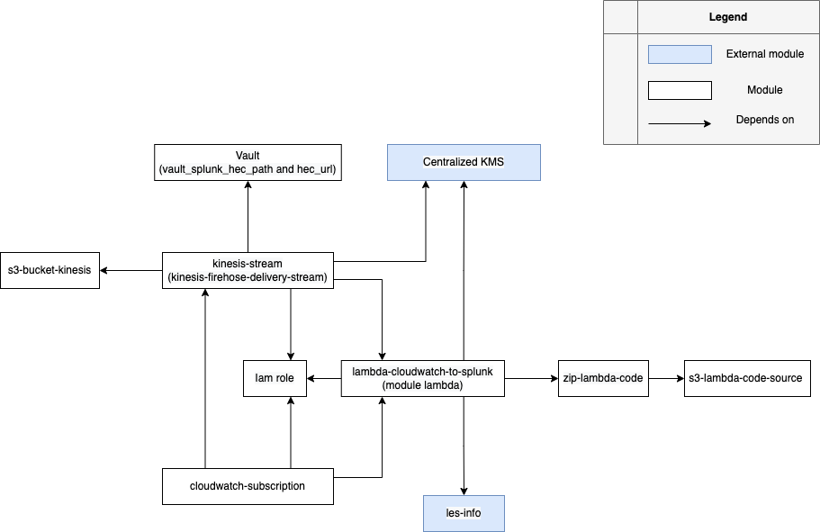

# Cloudwatch log to splunk module

This project defines a Terraform module that creates resources on AWS in two different regions (ca-central-1 and eu-west-1) simultaneously to send cloudwatch logs to splunk. Each module gets a separate state and is technically independant but logically not (see Modules Logical Dependencies). Some modules build a ressource that will be used by another module.

## Requirements

The following are required for this module to work:

* Terraform v1.1.6
* A Security Group ID that needs to be created using [Firewall As Code User Guide](https://enroller-user-guide.7807.cloud.res.bngf.local/firewall/firewall_as_code.html).
* [Permissions boundaries](https://git.bnc.ca/projects/MFT7807/repos/enroller-aws-permissions/browse/permissions/6157/policies/boundaries.yaml)

## Providers

| Name | Version |
|------|---------|
| aws | ~> 4.25.0 |
| vault | ~> 3.8.1 |

## Terraform Provider

The Terraform provider with the region must be configured in the module call.
See [example](https://git.bnc.ca/projects/APP5874/repos/aws-example-aurora-global-postgresql/browse/aurora-global-postgresql/configs/non_production/development/input.tfvars).

The region value must be "ca-central-1" for the primary and "eu-west-1" for the secondary.

## Created Resources



## Modules Logical Dependencies

This dependencies tree shows the interdependencies between modules.



## Modules' Descriptions

This part will explain for each module :

* Goal
* Input
* Created infrastructure objects
* Output

---

### Centralized KMS

A centralized KMS is used to provide the security keys to encrypt data from Lambda, CloudWatch and Kinesis firehose. More information on this centralized KMS can be found [here](https://wiki.bnc.ca/display/5KKMS/Developer+guide+on+how+to+use+the+Central+KMS).

### Cloudwatch-subscription

#### Goal

The goal here is to have log groups that will be used to fill the log stream, and to have the log subscription filter for kinesis firehose.

#### Created infrastructure objects

* Log group is declared as input for the logstream in the primary region
* Log subscription filter

#### Defined variables in the module

| Name | Description | Type | Default | Required |
|------|-------------|------|---------|:--------:|
| <a name="input_account_id"></a> [account\_id](#input\_account\_id) | Account ID of the owner. | `string` | N/A | yes |
| <a name="input_kinesis_parameter_arn"></a> [kinesis\_parameter\_arn](#input\_kinesis\_parameter\_arn) | Kinesis ARN from SSM. | `string` | N/A | yes |
| <a name="input_name_cloudwatch_logs_to_ship"></a> [name\_cloudwatch\_logs\_to\_ship](#input\_name\_cloudwatch\_logs\_to\_ship) | List of group names that you want to ship to Splunk. | `map(string)` | N/A | yes |
| <a name="input_cloudwatch_to_firehose_trust_iam_role_name"></a> [cloudwatch\_to\_firehose\_trust\_iam\_role\_name](#input\_cloudwatch\_to\_firehose\_trust\_iam\_role\_name) | IAM Role name for CloudWatch to Kinesis Firehose subscription. | `string` | N/A | yes |
| <a name="input_cloudwatch_to_fh_access_policy_name"></a> [cloudwatch\_to\_fh\_access\_policy\_name](#input\_cloudwatch\_to\_fh\_access\_policy\_name) | Name of IAM policy attached to the IAM role for CloudWatch to Kinesis Firehose subscription. | `string` | N/A | yes |
| <a name="input_cloudwatch_log_filter_name"></a> [cloudwatch\_log\_filter\_name](#input\_cloudwatch\_log\_filter\_name) | Name of Log Filter for CloudWatch Log subscription to Kinesis Firehose. | `string` | N/A | yes |

#### Outputs

| Name | Description |
|------|-------------|
| <a name="output_aws_region"></a> [aws\_region](#output\_aws\_region) | The AWS region that has been chosen as primary. |
| <a name="output_log_group_name"></a> [log\_group\_name](#output\_log\_group\_name) | The name of the CloudWatch log group you want to ship to splunk. |

---

### kinesis-stream

#### Goal

Kinesis firehose is an ETL (Extract, Transform and Load) service, in this section we will build a service that reliably captures, transforms, and delivers streaming data to analytics services.

#### Created infrastructure objects

* Log group is declared as input for log stream.
* Log stream is declared as input for kinesis firehose.
* kinesis firehose delivery stream to lambda, cloudwatch, splunk and S3.

#### Defined variables in the module

| Name | Description | Type | Default | Required |
|------|-------------|------|---------|:--------:|
| <a name="input_account_id"></a> [account\_id](#input\_account\_id) | Account ID of the owner. | `number` | N/A | yes |
| <a name="input_tags"></a> [tags](#input\_tags) | Map of tags to put on the resource. | `map(string)` | `{}` | no |
| <a name="input_vault_splunk_hec_path"></a> [vault\_splunk\_hec\_path](#input\_vault\_splunk\_hec\_path) | Vault path to get splunk security token. | `string` | `{}` | yes |
| <a name="input_hec_url"></a> [hec\_url](#input\_hec\_url) | Splunk Kinesis URL for submitting CloudWatch logs to splunk. | `string` | `{}` | yes |
| <a name="input_name_ssm_parameter_kinesis_arn"></a> [name\_ssm\_parameter\_kinesis\_arn](#input\_name\_ssm\_parameter\_kinesis\_arn) | Kinesis arn from SSM. | `string` | `{}` | yes |
| <a name="input_name_ssm_parameter_s3_arn"></a> [name\_ssm\_parameter\_s3\_arn](#input\_name\_ssm\_parameter\_s3\_arn) | Arn of s3 bucket used by kinesis from SSM. | `string` | `{}` | yes |
| <a name="input_name_ssm_parameter_lambda_arn"></a> [name\_ssm\_parameter\_lambda\_arn](#input\_name\_ssm\_parameter\_lambda\_arn) | Arn of lambda function processed by kinesis. | `string` | `{}` | yes |
| <a name="input_kinesis_firehose_role_name"></a> [kinesis\_firehose\_role\_name](#input\_kinesis\_firehose\_role\_name) | Name of IAM Role for the Kinesis Firehose. | `string` | N/A | yes |
| <a name="input_kinesis_firehose_iam_policy_name"></a> [kinesis\_firehose\_iam\_policy\_name](#input\_kinesis\_firehose\_iam\_policy\_name) | Name of the IAM Policy attached to IAM Role for the Kinesis Firehose. | `string` | N/A | yes |
| <a name="input_firehose_name"></a> [firehose\_name](#input\_firehose\_name) | The kinesis firehose name in the primary region. | `string` | N/A | yes |
| <a name="input_aws_cloudwatch_log_group_name"></a> [aws\_cloudwatch\_log\_group\_name](#input\_aws\_cloudwatch\_log\_group\_name) | The Kinesis cloudwatch log group name. | `string` | N/A | yes |
| <a name="input_aws_cloudwatch_log_stream_name"></a> [aws\_cloudwatch\_log\_stream\_name](#input\_aws\_cloudwatch\_log\_stream\_name) | Name of the CloudWatch log stream for Kinesis Firehose CloudWatch log group. | `string` | N/A | yes |
| <a name="input_kms_key_id"></a> [kms\_key\_id](#input\_kms\_key\_id) | The ARN of the KMS key used by the S3 bucket in the primary region. | `string` | N/A | yes |
| <a name="input_kms_key_id_dr"></a> [kms\_key\_id\_dr](#input\_kms\_key\_id\_dr) | The ARN of the KMS key used by the S3 bucket in the secondary region. | `string` | N/A | yes |

#### Outputs

No ouput

---

### lambda-cloudwatch-to-splunk

#### Goal

Create Lambda that allows us to add custom logic to resources, so we can easily apply compute to data as it enters or moves through the cloud.

#### Created infrastructure objects

* Lambda

#### Defined variables in the module

| Name | Description | Type | Default | Required |
|------|-------------|------|---------|:--------:|
| <a name="input_function_name"></a> [function\_name](#input\_function\_name) | A unique name for your Lambda Function in the primary region. | `string` | N/A | yes |
| <a name="input_description"></a> [description](#input\_description) | Description of your Lambda Function. | `string` | N/A | no |
| <a name="input_handler"></a> [handler](#input\_handler) | Lambda Function entrypoint in your code. | `string` | `{}` | yes |
| <a name="input_runtime"></a> [runtime](#input\_runtime) | The execution environment base of languages, Lambda Function runtime. | `string` | N/A | yes |
| <a name="input_s3_existing_package"></a> [s3\_existing\_package](#input\_s3\_existing\_package) | The S3 bucket object with keys bucket in the primary region, key, version pointing to an existing zip-file to use. | `map(string)` | `{}` | yes |
| <a name="input_s3_existing_package_dr"></a> [s3\_existing\_package\_dr](#input\_s3\_existing\_package\_dr) | The S3 bucket object with keys bucket in the secondary region, key, version pointing to an existing zip-file to use. | `map(string)` | `{}` | yes |
| <a name="input_tags"></a> [tags](#input\_tags) | A map of tags to assign to resources. | `map(string)` | `{}` | yes |
| <a name="input_tag_environment"></a> [tag\_environment](#input\_tag\_environment) | Inform the environment in which you deploy your resource. | `string` | N/A | yes |
| <a name="input_tag_applicationid"></a> [tag\_applicatioid](#input\_tag\_applicationid) | Fill in the application ID number. | `string` | N/A | yes |
| <a name="input_tag_email_support"></a> [tag\_email\_support](#input\_tag\_email\_support) | Fill in the email address of the resource's support team. | `string` | N/A | yes |
| <a name="input_tag_support_group"></a> [tag\_support\_group](#input\_tag\_support\_group) | Fill in the name of the resource's support group. | `string` | N/A | yes |
| <a name="input_tag_account"></a> [tag\_account](#input\_tag\_account) | Fill in the name of the account. | `string` | N/A | yes |
| <a name="input_tag_asset_owner"></a> [tag\_asset\_owner](#input\_tag\_asset\_owner) | Fill in the name of the asset owner. | `string` | N/A | yes |
| <a name="input_tag_jira_project_key"></a> [tag\_jira\_project\_key](#input\_tag\_jira\_project\_key) | Fill in the name of the jira project key. | `string` | N/A | yes |
| <a name="input_policy_lambda"></a> [policy\_lambda](#input\_policy\_lambda) | The path of the policy in IAM (json file) for Lambda. | `string` | N/A | yes |
| <a name="input_name_ssm_parameter_lambda_arn"></a> [name\_ssm\_parameter\_lambda\_arn](#input\_name\_ssm\_parameter\_lambda\_arn) | Name of the ssm parameter. | `string` | N/A | yes |
| <a name="input_kms_key_arn"></a> [kms\_key\_arn](#input\_kms\_key\_arn) | The ARN for the KMS encryption key in the primary region. | `string` | N/A | yes |
| <a name="input_kms_key_arn_dr"></a> [kms\_key\_arn\_dr](#input\_kms\_key\_arn\_dr) | The ARN for the KMS encryption key in the secondary region. | `string` | N/A | yes |
| <a name="input_les"></a> [les](#input\_les) | The Logical Environment Specifier (LES). Can be either \"sbx\", \"dev\", \"stg\" or \"prd\". | `string` | N/A | yes |

#### Outputs

| Name | Description |
|------|-------------|
| <a name="output_aws_region"></a> [aws\_region](#output\_aws\_region) | The AWS region that has been chosen as primary. |
| <a name="output_lambda_function_arn"></a> [lambda\_function\_arn](#output\_lambda\_function\_arn) | The ARN of the Lambda Function. |
| <a name="output_lambda_function_name"></a> [lambda\_function\_name](#output\_lambda\_function\_name) | The name of the Lambda Function. |
| <a name="output_lambda_function_handler"></a> [lambda\_function\_handler](#output\_lambda\_function\_handler) | The Lambda Function entrypoint in your code. |
| <a name="output_lambda_function_runtime"></a> [lambda\_function\_runtime](#output\_lambda\_function\_runtime) | Lambda Function runtime. |

---

### s3-bucket

#### Goal

Create s3 buckets to store and retrieve objects.

#### Created infrastructure objects

* s3-bucket-kinesis
* s3-lambda-code-source

#### Defined variables in the module

| Name | Description | Type | Default | Required |
|------|-------------|------|---------|:--------:|
| <a name="input_tags"></a> [tags](#input\_tags) | A mapping of tags to assign to resource. | `map(string)` | `{}` | yes |
| <a name="input_bucket"></a> [bucket](#input\_bucket) | The name of the bucket in the primary region. If omitted, Terraform will assign a random, unique name. | `string` | N/A | yes |
| <a name="input_enable_s3_notification"></a> [enable\_s3\_notification](#input\_enable\_s3\_notification) | enable or disable notification S3. | `bool` | `false` | yes |
| <a name="input_enable_s3_replication"></a> [enable\_s3\_replication](#input\_enable\_s3\_replication) | enable or disable replication S3. | `bool` | `false` | yes |
| <a name="input_tag_environment"></a> [tag\_environment](#input\_tag\_environment) | Inform the environment in which you deploy your resource. | `string` | N/A | yes |
| <a name="input_tag_applicationid"></a> [tag\_applicatioid](#input\_tag\_applicationid) | Fill in the application ID number. | `string` | N/A | yes |
| <a name="input_tag_email_support"></a> [tag\_email\_support](#input\_tag\_email\_support) | Fill in the email address of the resource's support team. | `string` | `{}` | yes |
| <a name="input_tag_support_group"></a> [tag\_support\_group](#input\_tag\_support\_group) | Fill in the name of the resource's support group. | `string` | N/A | yes |
| <a name="input_tag_account"></a> [tag\_account](#input\_tag\_account) | Fill in the name of the account. | `string` | N/A | yes |
| <a name="input_tag_asset_owner"></a> [tag\_asset\_owner](#input\_tag\_asset\_owner) | Fill in the name of the asset owner. | `string` | N/A | yes |
| <a name="input_tag_jira_project_key"></a> [tag\_jira\_project\_key](#input\_tag\_jira\_project\_key) | Fill in the name of the jira project key. | `string` | N/A | yes |
| <a name="input_name_ssm_parameter_input"></a> [name\_ssm\_parameter\_input](#input\_name\_ssm\_parameter\_input) | S3 bucket arn to store into SSM. | `string` | N/A | yes |

#### Outputs

| Name | Description |
|------|-------------|
| <a name="output_aws_region"></a> [aws\_region](#output\_aws\_region) | The AWS region that has been chosen as primary. |
| <a name="output_aws_region_dr"></a> [aws\_region\_dr](#output\_aws\_region\_dr) | The AWS region that has been choose as secondary. |
| <a name="output_bucket_id_origin"></a> [bucket\_id\_origin](#output\_bucket\_id\_origin) | The name of the origin bucket. |
| <a name="output_bucket_id_replica"></a> [bucket\_id\_replica](#output\_bucket\_id\_replica) | The name of the replicated bucket. |
| <a name="output_bucket_region_origin"></a> [bucket\_region\_origin](#output\_bucket\_region\_origin) | The AWS region in which the origin bucket resides in. |
| <a name="output_bucket_region_replica"></a> [bucket\_region\_replica](#output\_bucket\_region\_replica) | The AWS region in which the replicated bucket resides in. |

---

### zip-lambda-code

#### Goal

Upload the lambda function code to the buckets.

#### Created infrastructure objects

* s3-bucket-object

#### Defined variables in the module

| Name | Description | Type | Default | Required |
|------|-------------|------|---------|:--------:|
| <a name="input_tags"></a> [tags](#input\_tags) | A mapping of tags to assign to resource. | `map(string)` | `{}` | yes |
| <a name="input_bucket"></a> [bucket](#input\_bucket) | The bucket for the source code in the primary region. | `string` | N/A | yes |

#### Outputs

| Name | Description |
|------|-------------|
| <a name="output_aws_region"></a> [aws\_region](#output\_aws\_region) | The AWS region that has been chosen as primary. |
| <a name="output_source_code_move_file_id"></a> [source\_code\_move\_file\_id](#output\_source\_code\_move\_file\_id) | The ID of the move file object. |
| <a name="output_source\_code\_bucket"></a> [source\_code\_bucket](#output\_source\_code\_bucket) | The name of the source code bucket. |

---

## Tests

```bash
cd examples/simple-example

terraform init -reconfigure -upgrade -backend-config=configs/non_production/development/backend.tfvars

terraform apply -var-file=configs/non_production/development/input.tfvars

terraform output -json > ../../tests/files/terraform-outputs.json

inspec exec tests --no-create-lockfile -t aws://ca-central-1

terraform destroy -no-color -auto-approve -var-file=configs/non_production/development/input.tfvars
```

## Versioning

We use [SemVer](http://semver.org/) for versioning.

## Authors

* [Eve Hamilton](https://git.bnc.ca/plugins/servlet/user-contributions/hame008)
* [Laurent Raharison](https://git.bnc.ca/plugins/servlet/user-contributions/rahl002)
* [Joel Moum](https://git.bnc.ca/plugins/servlet/user-contributions/mouj010)

See also the list of [contributors](https://git.bnc.ca/plugins/servlet/graphs/activity/APP6157/terraform-root-log-cloudwatch-to-splunk?refId=all-branches&from=2022-04-04&to=2022-05-04) who participated in this project.

## License

No License
