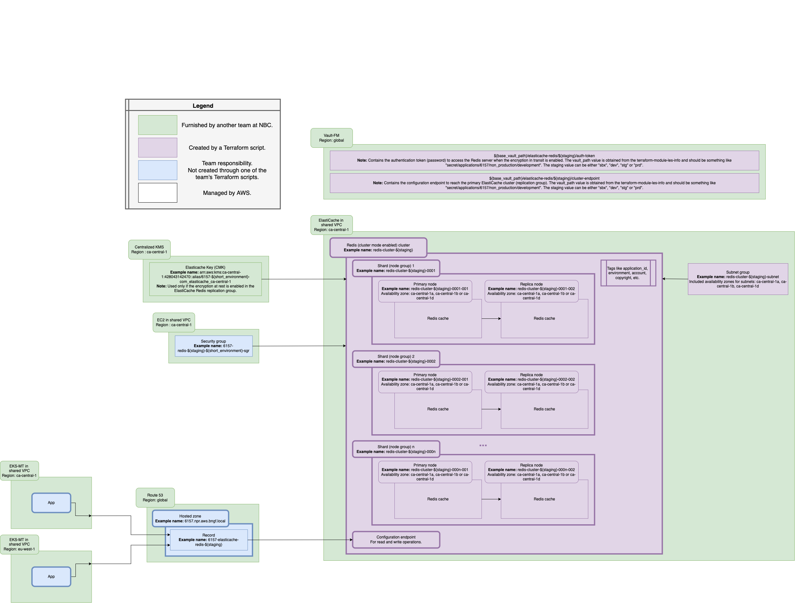

# AWS ElastiCache Redis Terraform Module

This project defines a Terraform module that creates an ElastiCache Redis cluster on AWS with the related resources needed to be compliant with NBC requirements. More specifically, the Terraform script in this repository is instancing a Redis (cluster mode enabled) cluster/replication group. Since a Backup and restore strategy will be used for the DR, the cluster will not be associated to a global datastore and will not include a secondary replication group for disaster recovery.

ElastiCache is an AWS service used for managing cache technologies. It currently supports both Redis and Memcached. Caches are in-memory databases characterized by really high performance and low latency that help reduce load off of standard databases (like the ones deployed in the AWS RDS service) for read intensive workloads. A cache can also help make the applications (such as the micro-services running in AWS EKS) using it stateless. Similarly to the RDS service, AWS ElastiCache will take care of OS maintenance, patching, optimizations, setup, configuration, monitoring, failure recovery and backups. The Redis ElastiCache technology, more specifically, allows to do multi-AZ with auto-failover and it includes both backup and restore features.

The ElastiCache Redis cluster deployed in this script will use the "cluster mode enabled" mode which means that the cache data will be stored in multiple shards (also called node groups) in the cluster. See the [Redis cluster configuration](https://docs.aws.amazon.com/AmazonElastiCache/latest/red-ug/cluster-create-determine-requirements.html#redis-cluster-configuration) page for a diagram of the differences between the "cluster mode enabled" and "cluster mode disabled" modes. In the "cluster mode enabled" mode, the data is partitioned across many shards to help scale writes in the cache database. Each shard contains a specific number of nodes. The nodes in a Redis shard fulfill one of two roles: one read/write primary and all other nodes are read-only secondaries (also called read replicas). Thus, each shard will have one primary node (for read and write operations) and up to five replica nodes (for read operations only). The read replicas are used to scale reads and enable high availability of the cache. The number of replicas is set up equally across the shards which means that each shard/node group can only have the same number of replica nodes. ElastiCache Redis allows to set up to 500 nodes (including both primary and replica nodes) per cluster.

The application connects with a Redis cluster using a network address called an "endpoint". In addition to the node endpoints, the Redis cluster itself has an endpoint called the configuration endpoint. As stated in the AWS documentation, the application can use this endpoint to read from or write to the cluster, leaving the determination of which node to read from or write to up to ElastiCache for Redis. This endpoint will be exposed through a record in the Route 53 service and the FQDN (fully qualified domain name) from the created DNS record will be saved in the vault, along with the port to access the Redis cache in ElastiCache.

## Requirements

The following are required for this module to work.

* Terraform v1.1.9. The Terraform version used in the Jenkins pipeline is defined through the TERRAFORM_IMAGE_NAME environment variable.
* A security group to access the ElastiCache Redis cluster needs to be created using the [Firewall-As-Code](https://git.bnc.ca/projects/MFT7807/repos/firewall-manifests/browse).

## Providers

| Name | Version |
|------|---------|
| hashicorp/aws | ~> 4.22.0 |
| hashicorp/vault | ~> 3.7.0 |

The referenced Falcon module [terraform-aws-elasticache-cluster](https://git.bnc.ca/projects/APP15201/repos/terraform-aws-elasticache-cluster/browse) will also use the following Terraform plugins:

| Name | Version |
|------|---------|
| hashicorp/aws | >= 4.9.0 |
| hashicorp/vault | >= 2.24.0 |

The referenced Falcon module [terraform-aws-route53](https://git.bnc.ca/projects/APP15201/repos/terraform-aws-route53/browse) will also use the following Terraform plugins:

| Name | Version |
|------|---------|
| hashicorp/aws | >= 3.61.0 |

## Terraform Provider

The Terraform provider with the AWS region must be configured through the input variables defined in the input.tfvars file for the appropriate environment and stage. The region "ca-central-1" (Canada) should be used for the primary infrastructure while the resources should be replicated in the "eu-west-1" (Ireland) region when the disaster recovery mode is enabled. In this case, the disaster recovery infrastructure will not be created here since a Backup and restore strategy will be used for the DR.
See [example](https://git.bnc.ca/projects/APP6157/repos/terraform-root-elasticache/browse/elasticache/configs/non_production/sandbox/input.tfvars).

The AWS region value must be "ca-central-1" or "eu-west-1".

## Created Resources



## Modules' Descriptions

This part will explain for each module :

* Goal
* Inputs
* Outputs
* Created infrastructure objects

### LES Info

The LES Info module is used to procure centralized values that are exposed through output variables.

### Centralized KMS

The centralized KMS is used to provide the security keys (CMK) to encrypt data from the ElastiCache Redis database when the encryption at rest is enabled. Separate keys are used for the cache database deployed in Canada and the data replicated in Ireland. More information on the centralized KMS can be found [here](https://wiki.bnc.ca/display/5KKMS/Developer+guide+on+how+to+use+the+Central+KMS).

---

### Redis-cluster

#### Goal

This module is invoking the [terraform-aws-elasticache-cluster](https://git.bnc.ca/projects/APP15201/repos/terraform-aws-elasticache-cluster/browse) Falcon module to instanciate a Redis cluster (replication group) with cluster mode enabled. It will also create the cache subnet group to be used to the cluster and a custom parameter group that will be associated to the cluster if no other parameter group name is provided. If the creation of the DR is enabled through the specified input variable, the primary Redis replication group in Canada will be placed in a global datastore and a secondary replication group will be created in Ireland. According to the selected DR strategy, this module will not create the infrastructure to replicate the Redis cache in Ireland.

#### Created Infrastructure Objects

* A primary Redis cluster (replication group) with cluster mode enabled characterized by a custom number of shards (node groups) and replica nodes.
* A cache subnet group to be associated to the Redis cluster.
* A custom parameter group (to be associated to the cluster if no other parameter group is provided).
* A vault entry for the authentication token if the encryption in transit is enabled across the cluster.
* A vault entry to store the configuration endpoint address and port of the primary Redis cluster (replication group).
* An SSM parameter to store the ARN of the ElastiCache primary replication group.

If the DR creation is enabled, the following resources will also be created:

* A global datastore.
* A secondary Redis replication group associated to the global datastore and created from the primary Redis cluster.
* A cache subnet group for the secondary Redis cluster.

Note that when the replication groups are associated to a global datastore, it seems like AWS is automatically creating default parameter groups (one for the primary replication and one for the secondary replication group) to associate to the Redis clusters. As they are created by AWS, Terraform is not able to remove them when performing the destroy command.

#### Defined Variables in the Module

| Name | Description | Type | Default | Required |
|------|-------------|------|---------|:--------:|
| <a name="input_les"></a> [les](#input\_les) | The Logical Environment Specifier (LES). Can be either "dev", "sbx", "stg" or "prd". Used to retrieve some common variables in the les_info module. | `string` | N/A | yes |
| <a name="input_maintenance_window"></a> [maintenance\_window](#input\_maintenance\_window) | Specifies the weekly time range for when maintenance on the cache cluster is performed. The format is ddd:hh24:mi-ddd:hh24:mi (24H Clock UTC). The minimum maintenance window is a 60 minute period. | `string` | "fri:08:00-fri:09:00" | no |
| <a name="input_node_type"></a> [node\_type](#input\_node\_type) | The instance class to be used. Provides the memory and computational power of the cache nodes. The supported node types are documented [here](https://docs.aws.amazon.com/AmazonElastiCache/latest/red-ug/CacheNodes.SupportedTypes.html). As stated [here](https://docs.amazonaws.cn/en_us/AmazonElastiCache/latest/red-ug/Redis-Global-Datastores-Getting-Started.html), node types R5, R6g, R6gd, M5 and M6g only are supported for a global datastore. | `string` | N/A | yes |
| <a name="input_num_node_groups"></a> [num\_node\_groups](#input\_num\_node\_groups) | The number of node groups (shards) for the Redis cluster/replication group. Changing this number will trigger an online resizing operation before other settings modifications. | `number` | N/A | yes |
| <a name="input_region"></a> [region](#input\_region) | The target AWS primary region on which to create the main resources. Should be "ca-central-1". | `string` | N/A | yes |
| <a name="input_region_dr"></a> [region\_dr](#input\_region\_dr) | The target AWS disaster recovery (DR) region on which to create the backup resources. Should be "eu-west-1". | `string` | N/A | yes |
| <a name="input_replicas_per_node_group"></a> [replicas\_per\_node\_group](#input\_replicas\_per\_node\_group) | The number of replica nodes in each node group. Valid values are 0 to 5. Changing this number will trigger an online resizing operation before other settings modifications. | `number` | N/A | yes |
| <a name="input_replication_group_id"></a> [replication\_group\_id](#input\_replication\_group\_id) | The primary Redis cluster/replication group identifier. This parameter is stored as a lowercase string. | `string` | N/A | yes |
| <a name="input_security_group_name"></a> [security\_group\_name](#input\_security\_group\_name) | The name of the VPC security group to be associated with the cache cluster in the primary region. | `string` | N/A | yes |
| <a name="input_snapshot_retention_limit"></a> [snapshot\_retention\_limit](#input\_snapshot\_retention\_limit) | The number of days for which ElastiCache will retain automatic cache cluster snapshots before deleting them. For example, if the SnapshotRetentionLimit is set to 5, then a snapshot that was taken today will be retained for 5 days before being deleted. If the value of snapshot_retention_limit is set to zero (0), backups are turned off. | `number` | 0 | no |
| <a name="input_snapshot_window"></a> [snapshot\_window](#input\_snapshot\_window) | The daily time range (in UTC) during which ElastiCache will begin taking a daily snapshot of the cache cluster. The minimum snapshot window is a 60 minute period. | `string` | "06:30-07:30" | no |
| <a name="input_ssm_parameter_name"></a> [ssm\_parameter\_name](#input\_ssm\_parameter\_name) | The mame of the SSM parameter holding the ARN of the ElastiCache primary cluster/replication group. | `string` | N/A | yes |
| <a name="input_tags"></a> [tags](#input\_tags) | A mapping of tags to assign to all resources. | `map(string)` | {} | no |
| <a name="input_tag_account"></a> [tag\_account](#input\_tag\_account) | A tag for the account name. | `string` | "" | no |
| <a name="input_tag_application_id"></a> [tag\_application\_id](#input\_tag\_applicationid) | A tag for the application ID. Must be specified if the kms_key_id and dr_kms_key_id variables are null in the redis_cluster module. It will allow the KMS keys' alias to be defined within the redis_cluster module. | `string` | "" | no |
| <a name="input_tag_asset_owner"></a> [tag\_asset\_owner](#input\_tag\_asset\_owner) | A tag for the asset owner name. | `string` | "" | no |
| <a name="input_tag_email_support"></a> [tag\_email\_support](#input\_tag\_email\_support) | A tag for the email address of the resource's support team. | `string` | "" | no |
| <a name="input_tag_environment"></a> [tag\_environment](#input\_tag\_environment) | A tag for the environment in which the resources are being deployed (production or non-production). Must be specified if the kms_key_id and dr_kms_key_id variables are null in the redis_cluster module. It will allow the KMS keys' alias to be defined within the redis_cluster module. | `string` | "" | no |
| <a name="input_tag_jira_project_key"></a> [tag\_jira\_project\_key](#input\_tag\_jira\_project\_key) | A tag for the Jira project key name. | `string` | "" | no |
| <a name="input_tag_support_group"></a> [tag\_support\_group](#input\_tag\_support\_group) | A tag for the name of the resource's support group. | `string` | "" | no |

#### Outputs

| Name | Description |
|------|-------------|
| <a name="output_nodes_number"></a> [nodes\_number](#output\_nodes\_number) | The total number of nodes in the ElastiCache Redis primary replication group. |
| <a name="output_primary_region"></a> [primary\_region](#output\_primary\_region) | The AWS primary region hosting the ElastiCache cluster (Redis primary replication group). |
| <a name="output_replication_group_id"></a> [replication\_group\_id](#output\_replication\_group\_id) | The ID of the primary ElastiCache replication group. |
| <a name="output_replication_group_nodes_id"></a> [replication\_group\_nodes\_id](#output\_replication\_group\_nodes\_id) | Contains the identifiers of all the nodes that are part of the Redis primary replication group. |

#### Used Variables from the LES Info Module

| Name | Description | Type | Required |
|------|-------------|------|:--------:|
| base_vault_path | The base vault path to the application in the vault. Used to build a path to the vault for storing the Redis cluser's configuration endpoint address and port and the Redis authentication token which is used as a password to access the Redis server. | `string` | yes |
| dr_vpc_id | The target VPC ID in the secondary (disaster recovery) region. | `string` | yes |
| vpc_id | The target VPC ID in the primary region. | `string` | yes |

---

### Route-53

#### Goal

This module is invoking the [terraform-aws-route53](https://git.bnc.ca/projects/APP15201/repos/terraform-aws-route53/browse) Falcon module to create a CNAME record to map the cluster's configuration endpoint to a user-friendly DNS name in the specified hosted zone. As documented in AWS, the [configuration endpoint](https://docs.aws.amazon.com/AmazonElastiCache/latest/red-ug/Endpoints.html) should be used for all operations that support the cluster mode enabled commands and, as such, is only available for Redis clusters using the cluster mode enabled mode. This endpoint will be used to read or write to the cluster, leaving the determination of which node to read from or write to up to ElastiCache for Redis. However, the applications can still read from individual node endpoints (read endpoints). The created DNS record for the configuration endpoint will be saved in the vault to be used by the applications to access the Redis cluster.

#### Created Infrastructure Objects

* A CNAME record to map the cluster's configuration endpoint of the primary Redis cluster to a user-friendly DNS name.

#### Defined Variables in the Module

| Name | Description | Type | Default | Required |
|------|-------------|------|---------|:--------:|
| <a name="input_les"></a> [les](#input\_les) | The Logical Environment Specifier (LES). Can be either "dev", "sbx", "stg" or "prd". Used to retrieve some common variables in the les_info module. | `string` | N/A | yes |
| <a name="input_name"></a> [name](#input\_name) | The name of the Route 53 record to be created. It will be concatenated to the hosted zone name to generate the FQDN. | `string` | N/A | yes |
| <a name="input_private_zone"></a> [private\_zone](#input\_private\_zone) | Used with the zone_name variable to get a private hosted zone in Route 53. | `bool` | false | no |
| <a name="input_region"></a> [region](#input\_region) | The target AWS primary region on which to create the main resources. Should be "ca-central-1". | `string` | N/A | yes |
| <a name="input_zone_name"></a> [zone\_name](#input\_zone\_name) | The hosted zone name of the desired hosted (DNS) zone in Route 53. | `string` | N/A | yes |

#### Outputs

| Name | Description |
|------|-------------|
| <a name="output_hosted_zone_id"></a> [hosted\_zone\_id](#output\_hosted\_zone\_id) | The ID of the hosted zone in which the record is created. |
| <a name="output_primary_region"></a> [primary\_region](#output\_primary\_region) | The AWS primary region hosting the ElastiCache cluster (Redis primary replication group). |
| <a name="output_record_fqdn"></a> [record\_fqdn](#output\_record\_fqdn) | The FQDN (fully qualified domaine name) built using the hosted zone domain and the record name. |

#### Used Variables from the LES Info Module

| Name | Description | Type | Required |
|------|-------------|------|:--------:|
| base_vault_path | The base vault path to the application in the vault. Used to retrieve the Redis cluser's configuration endpoint address to create the CNAME record in Route 53. | `string` | yes |

---

## Tests

```bash
cd redis-cluster

terraform init -reconfigure -upgrade -backend-config=configs/non_production/sandbox/backend.tfvars

terraform apply -var-file=configs/non_production/snadbox/input.tfvars

terraform output -json > ../../tests/files/terraform-outputs.json

inspec exec tests --no-create-lockfile -t aws://ca-central-1

terraform destroy -no-color -auto-approve -var-file=configs/non_production/sandbox/input.tfvars
```

## Versioning

We use [SemVer](http://semver.org/) for versioning.

## Authors

* [Eve Hamilton](https://git.bnc.ca/plugins/servlet/user-contributions/hame008)
* [Joel Moum](https://git.bnc.ca/plugins/servlet/user-contributions/mouj010)

See also the list of [contributors](https://git.bnc.ca/plugins/servlet/graphs/contributors/APP6157/terraform-root-aurora-postgres-cluster?refId=all-branches) who participated in this project.

## License

No license.
